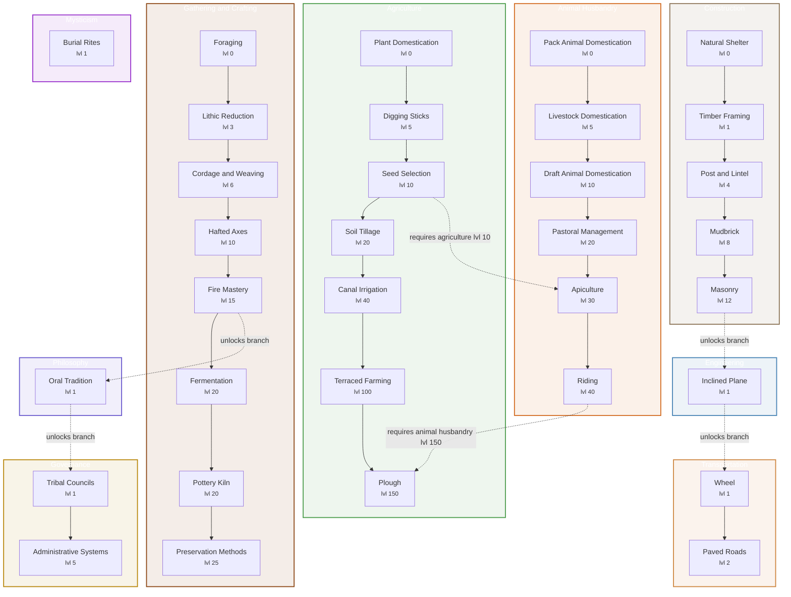
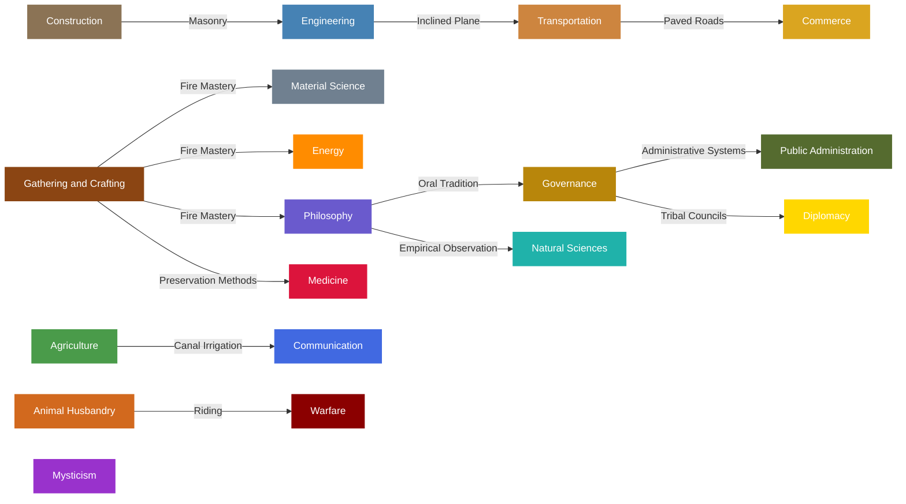

# Content Progression

_Auto-generated by `tools/generate_content_docs.gd` — do not edit manually._

## Tech Tree

Shows all branches and milestones. Milestones are ordered by required branch level.
Dashed arrows show cross-branch dependencies. Dotted arrows show which milestone unlocks a new branch.

## Content Unlocks

Shows what each milestone unlocks: buildings, units, and resources.
Milestone sequences are preserved within branch subgraphs.
Buildings and units sit outside branches. Resources show production and consumption flows.

```mermaid
graph LR

  subgraph agriculture_sub["Agriculture"]
    direction LR
    digging_sticks_u(["Digging Sticks"])
    seed_selection_u(["Seed Selection"])
    soil_tillage_u(["Soil Tillage"])
    canal_irrigation_u(["Canal Irrigation"])
    terraced_farming_u(["Terraced Farming"])
    digging_sticks_u --> seed_selection_u
    seed_selection_u --> soil_tillage_u
    soil_tillage_u --> canal_irrigation_u
    canal_irrigation_u --> terraced_farming_u
  end
  style agriculture_sub fill:#4A9B4A18,stroke:#4A9B4A,stroke-width:2px,color:#fff

  subgraph animal_husbandry_sub["Animal Husbandry"]
    direction LR
    pack_animal_domestication_u(["Pack Animal Domestication"])
    livestock_domestication_u(["Livestock Domestication"])
    pastoral_management_u(["Pastoral Management"])
    apiculture_u(["Apiculture"])
    pack_animal_domestication_u --> livestock_domestication_u
    livestock_domestication_u --> pastoral_management_u
    pastoral_management_u --> apiculture_u
  end
  style animal_husbandry_sub fill:#D2691E18,stroke:#D2691E,stroke-width:2px,color:#fff

  subgraph gathering_and_crafting_sub["Gathering and Crafting"]
    direction LR
    foraging_u(["Foraging"])
    lithic_reduction_u(["Lithic Reduction"])
    cordage_and_weaving_u(["Cordage and Weaving"])
    hafted_axes_u(["Hafted Axes"])
    fire_mastery_u(["Fire Mastery"])
    fermentation_u(["Fermentation"])
    pottery_kiln_u(["Pottery Kiln"])
    preservation_methods_u(["Preservation Methods"])
    foraging_u --> lithic_reduction_u
    lithic_reduction_u --> cordage_and_weaving_u
    cordage_and_weaving_u --> hafted_axes_u
    hafted_axes_u --> fire_mastery_u
    fire_mastery_u --> fermentation_u
    fermentation_u --> pottery_kiln_u
    pottery_kiln_u --> preservation_methods_u
  end
  style gathering_and_crafting_sub fill:#8B451318,stroke:#8B4513,stroke-width:2px,color:#fff

  subgraph construction_sub["Construction"]
    direction LR
    natural_shelter_u(["Natural Shelter"])
    timber_framing_u(["Timber Framing"])
    post_and_lintel_u(["Post and Lintel"])
    mudbrick_u(["Mudbrick"])
    masonry_u(["Masonry"])
    natural_shelter_u --> timber_framing_u
    timber_framing_u --> post_and_lintel_u
    post_and_lintel_u --> mudbrick_u
    mudbrick_u --> masonry_u
  end
  style construction_sub fill:#8B735518,stroke:#8B7355,stroke-width:2px,color:#fff

  subgraph mysticism_sub["Mysticism"]
    direction LR
    burial_rites_u(["Burial Rites"])
  end
  style mysticism_sub fill:#9932CC18,stroke:#9932CC,stroke-width:2px,color:#fff

  subgraph philosophy_sub["Philosophy"]
    direction LR
    oral_tradition_u(["Oral Tradition"])
  end
  style philosophy_sub fill:#6A5ACD18,stroke:#6A5ACD,stroke-width:2px,color:#fff

  subgraph transportation_sub["Transportation"]
    direction LR
    wheel_u(["Wheel"])
  end
  style transportation_sub fill:#CD853F18,stroke:#CD853F,stroke-width:2px,color:#fff

  %% Buildings and units
  b_apiary(["Apiary"]):::building
  b_brewery(["Brewery"]):::building
  b_winery(["Winery"]):::building
  b_brick_kiln(["Brick Kiln"]):::building
  b_clay_pit(["Clay Pit"]):::building
  b_pottery_kiln(["Pottery Kiln"]):::building
  b_pit_house(["Pit House"]):::building
  b_cleared_field(["Cleared Field"]):::building
  b_food_cache(["Food Cache"]):::building
  b_crop_field(["Crop Field"]):::building
  b_cultivated_plot(["Cultivated Plot"]):::building
  b_elders_dwelling(["Elders Dwelling"]):::building
  b_fishing_hut(["Fishing Hut"]):::building
  b_hunters_lodge(["Hunters Lodge"]):::building
  u_caravan{{"Caravan"}}:::unit
  u_explorer{{"Explorer"}}:::unit
  b_flint_knapper(["Flint Knapper"]):::building
  b_furwrights_hollow(["Furwrights Hollow"]):::building
  b_reed_marsh(["Reed Marsh"]):::building
  b_weaver(["Weaver"]):::building
  b_gathering_hut(["Gathering Hut"]):::building
  b_grain_field(["Grain Field"]):::building
  b_irrigation_canal(["Irrigation Canal"]):::building
  b_granary(["Granary"]):::building
  b_herding_grounds(["Herding Grounds"]):::building
  b_hut(["Hut"]):::building
  b_longhouse(["Longhouse"]):::building
  u_nomadic_expedition{{"Nomadic Expedition"}}:::unit
  b_pasture(["Pasture"]):::building
  b_sacred_barrow(["Sacred Barrow"]):::building
  b_smoke_house(["Smoke House"]):::building
  b_stone_quarry(["Stone Quarry"]):::building
  b_storytellers_fire(["Storytellers Fire"]):::building
  b_tribal_camp(["Tribal Camp"]):::building
  b_vineyard(["Vineyard"]):::building
  b_woodcutter(["Woodcutter"]):::building
  u_hand_cart{{"Hand Cart"}}:::unit
  b_waycamp_lodge(["Waycamp Lodge"]):::building

  %% Milestone unlock arrows
  apiculture_u --> b_apiary
  fermentation_u --> b_brewery
  fermentation_u --> b_winery
  pottery_kiln_u --> b_brick_kiln
  pottery_kiln_u --> b_clay_pit
  pottery_kiln_u --> b_pottery_kiln
  mudbrick_u --> b_brick_kiln
  mudbrick_u --> b_pit_house
  natural_shelter_u --> b_cleared_field
  natural_shelter_u --> b_food_cache
  soil_tillage_u --> b_crop_field
  digging_sticks_u --> b_cultivated_plot
  oral_tradition_u --> b_elders_dwelling
  pack_animal_domestication_u --> b_fishing_hut
  pack_animal_domestication_u --> b_hunters_lodge
  pack_animal_domestication_u --> u_caravan
  pack_animal_domestication_u --> u_explorer
  lithic_reduction_u --> b_flint_knapper
  cordage_and_weaving_u --> b_furwrights_hollow
  cordage_and_weaving_u --> b_reed_marsh
  cordage_and_weaving_u --> b_weaver
  foraging_u --> b_gathering_hut
  canal_irrigation_u --> b_grain_field
  canal_irrigation_u --> b_irrigation_canal
  seed_selection_u --> b_granary
  livestock_domestication_u --> b_herding_grounds
  timber_framing_u --> b_hut
  timber_framing_u --> b_longhouse
  timber_framing_u --> u_nomadic_expedition
  pastoral_management_u --> b_pasture
  burial_rites_u --> b_sacred_barrow
  preservation_methods_u --> b_smoke_house
  masonry_u --> b_stone_quarry
  fire_mastery_u --> b_storytellers_fire
  post_and_lintel_u --> b_tribal_camp
  terraced_farming_u --> b_vineyard
  hafted_axes_u --> b_woodcutter
  wheel_u --> u_hand_cart

  %% Resources
  r_honey[/"Honey"/]:::resource
  r_beer[/"Beer"/]:::resource
  r_wine[/"Wine"/]:::resource
  r_clay[/"Clay"/]:::resource
  r_pottery[/"Pottery"/]:::resource
  r_bricks[/"Bricks"/]:::resource
  r_furs[/"Furs"/]:::resource
  r_tools[/"Tools"/]:::resource
  r_clothing[/"Clothing"/]:::resource
  r_fiber[/"Fiber"/]:::resource
  r_grain[/"Grain"/]:::resource
  r_grapes[/"Grapes"/]:::resource
  r_food[/"Food"/]:::resource_start
  r_stone[/"Stone"/]:::resource_start
  r_wood[/"Wood"/]:::resource_start

  %% Milestone unlocks resources
  apiculture_u -.-> r_honey
  fermentation_u -.-> r_beer
  fermentation_u -.-> r_wine
  pottery_kiln_u -.-> r_clay
  pottery_kiln_u -.-> r_pottery
  mudbrick_u -.-> r_bricks
  pack_animal_domestication_u -.-> r_furs
  lithic_reduction_u -.-> r_tools
  cordage_and_weaving_u -.-> r_clothing
  cordage_and_weaving_u -.-> r_fiber
  canal_irrigation_u -.-> r_grain
  terraced_farming_u -.-> r_grapes

  %% Production: building produces resource
  b_apiary -- produces --> r_honey
  b_brewery -- produces --> r_beer
  b_brick_kiln -- produces --> r_bricks
  b_clay_pit -- produces --> r_clay
  b_crop_field -- produces --> r_food
  b_cultivated_plot -- produces --> r_food
  b_fishing_hut -- produces --> r_food
  b_flint_knapper -- produces --> r_tools
  b_furwrights_hollow -- produces --> r_clothing
  b_gathering_hut -- produces --> r_food
  b_gathering_hut -- produces --> r_wood
  b_gathering_hut -- produces --> r_stone
  b_grain_field -- produces --> r_grain
  b_herding_grounds -- produces --> r_food
  b_hunters_lodge -- produces --> r_food
  b_hunters_lodge -- produces --> r_furs
  b_pasture -- produces --> r_food
  b_pottery_kiln -- produces --> r_pottery
  b_reed_marsh -- produces --> r_fiber
  b_stone_quarry -- produces --> r_stone
  b_vineyard -- produces --> r_grapes
  b_weaver -- produces --> r_clothing
  b_winery -- produces --> r_wine
  b_woodcutter -- produces --> r_wood

  %% Consumption: building consumes resource
  r_grain -. consumes .-> b_brewery
  r_wood -. consumes .-> b_brewery
  r_clay -. consumes .-> b_brick_kiln
  r_wood -. consumes .-> b_brick_kiln
  r_fiber -. consumes .-> b_brick_kiln
  r_tools -. consumes .-> b_clay_pit
  r_tools -. consumes .-> b_crop_field
  r_tools -. consumes .-> b_cultivated_plot
  r_food -. consumes .-> b_elders_dwelling
  r_wood -. consumes .-> b_elders_dwelling
  r_clothing -. consumes .-> b_elders_dwelling
  r_honey -. consumes .-> b_elders_dwelling
  r_wood -. consumes .-> b_flint_knapper
  r_stone -. consumes .-> b_flint_knapper
  r_furs -. consumes .-> b_furwrights_hollow
  r_tools -. consumes .-> b_grain_field
  r_food -. consumes .-> b_hut
  r_food -. consumes .-> b_longhouse
  r_tools -. consumes .-> b_pasture
  r_food -. consumes .-> b_pit_house
  r_clothing -. consumes .-> b_pit_house
  r_clay -. consumes .-> b_pottery_kiln
  r_wood -. consumes .-> b_pottery_kiln
  r_wood -. consumes .-> b_smoke_house
  r_tools -. consumes .-> b_stone_quarry
  r_wood -. consumes .-> b_storytellers_fire
  r_food -. consumes .-> b_tribal_camp
  r_food -. consumes .-> b_waycamp_lodge
  r_fiber -. consumes .-> b_weaver
  r_grapes -. consumes .-> b_winery
  r_wood -. consumes .-> b_winery
  r_tools -. consumes .-> b_woodcutter

  %% Building upgrades
  b_cultivated_plot == upgrades ==> b_crop_field
  b_herding_grounds == upgrades ==> b_pasture
  b_longhouse == upgrades ==> b_tribal_camp

  %% Styling
  classDef building fill:#2d5a1e,stroke:#4a7c3f,color:#fff
  classDef unit fill:#1e3a5a,stroke:#4682B4,color:#fff
  classDef resource fill:#8B6914,stroke:#DAA520,color:#fff
  classDef resource_start fill:#8B6914,stroke:#FFD700,stroke-width:3px,color:#fff
```

## Branch Unlock Chain

Shows how branches are unlocked from other branches via milestones.

